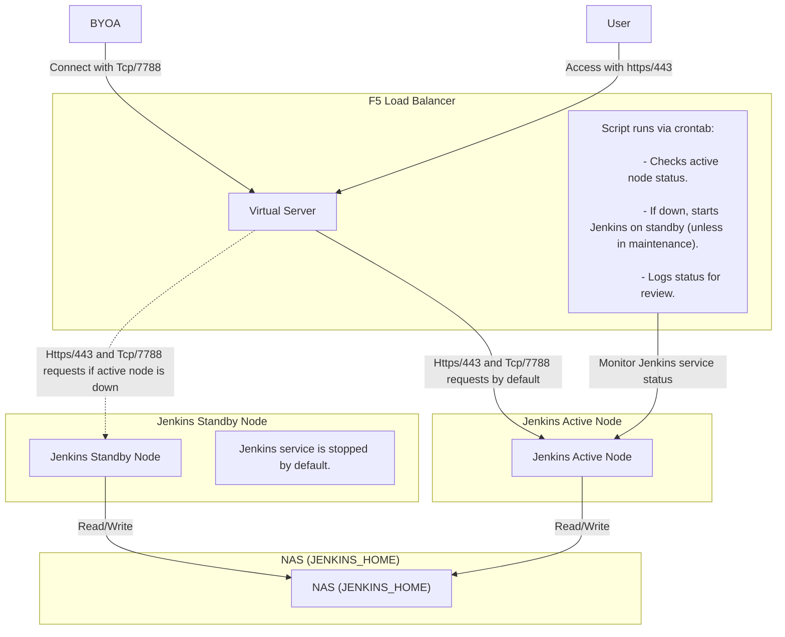

**Explanation:**

- **Participants:**
  - `User`: Represents the end-user accessing the Jenkins service.
  - `BYOA`: Denotes the Bring Your Own Application connecting to the service.
  - `VS` (Virtual Server): Acts as the entry point for incoming requests, managed by the F5 Load Balancer.
  - `Active` and `Standby`: Represent the active and standby Jenkins nodes, respectively.
  - `NAS`: The Network-Attached Storage where Jenkins data is stored.
  - `Script`: The monitoring script responsible for overseeing Jenkins service status.

- **Interactions:**
  - The `User` and `BYOA` initiate connections to the `Virtual Server` using specified protocols and ports.
  - The `Virtual Server` forwards requests to the `Active` node by default.
  - If the `Active` node is down, the `Virtual Server` redirects requests to the `Standby` node.
  - The `Script` continuously monitors the `Active` node's status and facilitates failover processes if necessary.
  - Both `Active` and `Standby` nodes perform read/write operations on the `NAS` to access Jenkins data.

**Integrating Mermaid.js into Markdown:**

To render Mermaid diagrams within your Markdown files, ensure that your Markdown processor supports Mermaid.js. For instance, GitHub supports Mermaid diagrams in Markdown files, issues, and pull requests. :contentReference[oaicite:0]{index=0} If your current environment does not support Mermaid.js, consider using platforms or tools that do, or explore alternatives like embedding static images of your diagrams.

For more detailed information on creating sequence diagrams with Mermaid.js, refer to the official documentation. :contentReference[oaicite:1]{index=1}
::contentReference[oaicite:2]{index=2}
 
