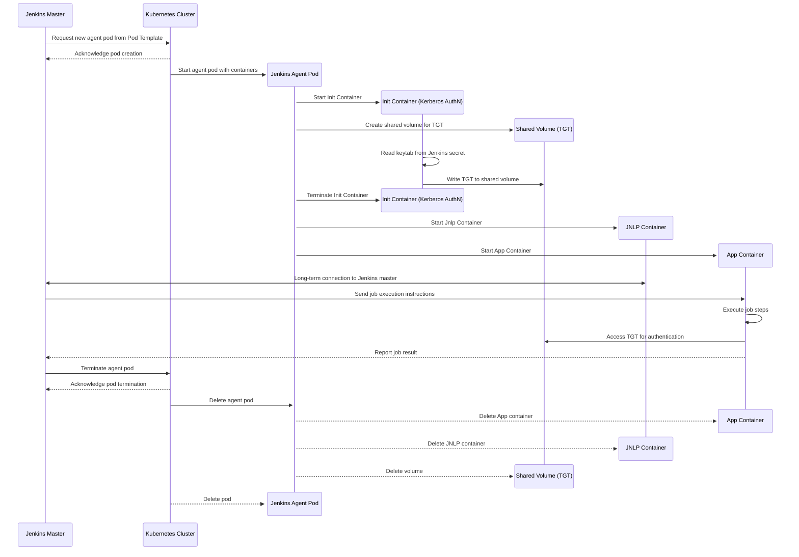
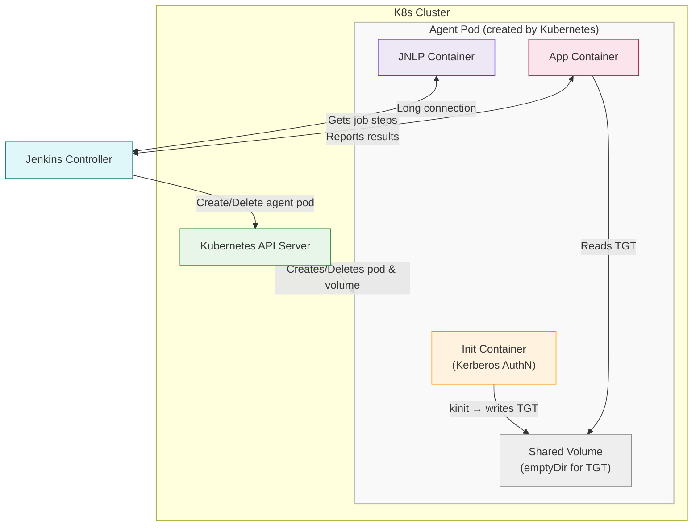

# ADR: Use OpenShift (CKS) to Host Jenkins Agents

**Status**: Proposed  
**Date**: 2025-07-11  
**Decision Makers**: [List of stakeholders]

## Context

Our CI/CD infrastructure currently relies on VM-based Jenkins agents, which introduces several inefficiencies:

- Users must manually configure their Jenkins agent environments in the host configuration and wait for machine provisioning.
- After a machine is provisioned, additional steps are often required — such as applying custom configurations — to make the node usable as a Jenkins agent.
- Agent VMs may remain idle when not in use, wasting resources.
- The system does not scale dynamically with build workloads.

To improve scalability, manageability, and resource efficiency, we propose running Jenkins agents as **ephemeral pods** within the **OpenShift (CKS)** environment.

## Decision

We will use OpenShift (CKS) to host Jenkins agents as Kubernetes pods by:

- Leveraging the Jenkins Kubernetes plugin to dynamically launch agents in response to build demand.
- Defining standard agent pod images tailored to specific environments (e.g., Java, Python).
- Applying resource limits and auto-scaling policies to optimize resource usage and cost.

Additionally, for workloads requiring **Kerberos authentication**, we will incorporate an `initContainer` in the agent pod template. This container will handle the authentication process by performing a `kinit` using a keytab file securely loaded from Jenkins credentials.

### Kerberos Authentication Flow

1. **Keytab Injection**  
   - A Base64-encoded keytab is stored as a Jenkins "Secret Text" credential.  
   - When a pod is provisioned, the credential is loaded and injected into the initContainer via environment variable.

2. **Kerberos InitContainer**  
   - Uses a specialized image capable of Kerberos (`kinit`) authentication.  
   - Decodes the keytab and runs `kinit` to obtain a Ticket Granting Ticket (TGT).  
   - Writes the Kerberos cache (e.g., `/tmp/krb5cc_...`) into a shared `emptyDir` volume.

3. **Application Container**  
   - The main application container mounts the same shared volume.  
   - It accesses the Kerberos TGT and uses it to perform authenticated operations during job execution.

### Sequence Diagram

##Consequences
Pros
✅ Elastic Scalability: Jenkins agents can be created and destroyed dynamically, based on actual workload.

✅ Resource Efficiency: Eliminates idle VM costs by using ephemeral containers that terminate after use.

✅ Improved Security and Isolation: Each job runs in a fresh pod with strict resource and security boundaries.

Cons
⚠️ Requires changes to job definitions or shared libraries to adopt pod templates.

⚠️ Complexity in managing secrets (e.g., Kerberos keytab handling) within a containerized environment.

⚠️ Potential initial learning curve for users unfamiliar with Kubernetes-native agent behavior.