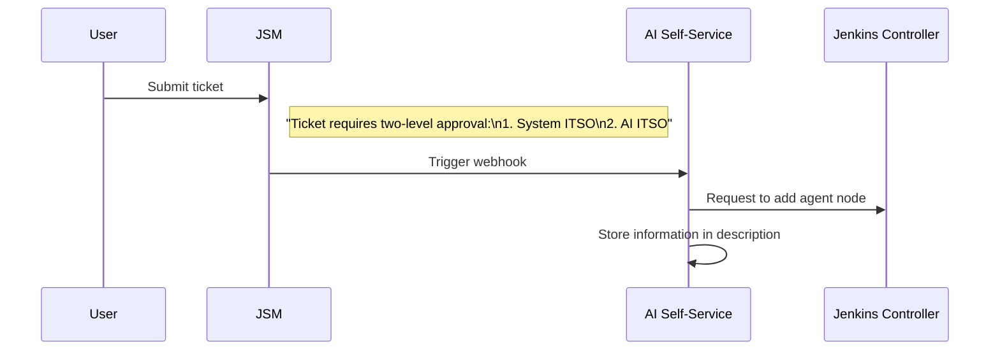
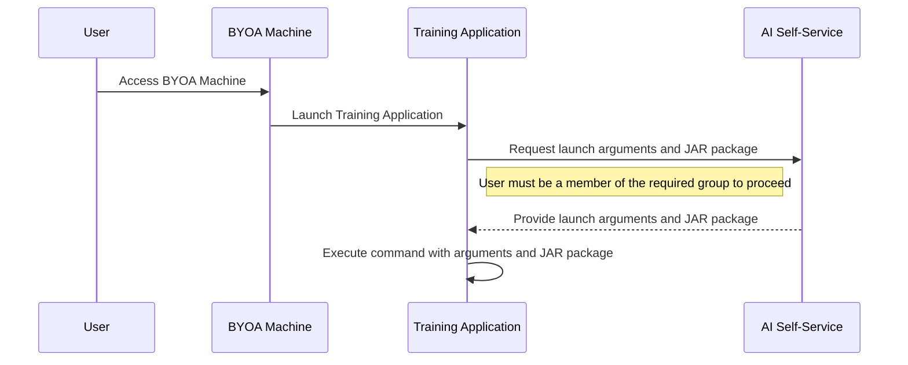

# Architectural Decision Record: Jenkins Node Type

## Status

## Context
In our solution, Jenkins agents are required to execute build and deployment tasks to the QA environment. These agents can be configured in different ways depending on the use case and infrastructure requirements. Therefore, we recommend users to prioritize the first type - BYOA. However, we also provide two other options:

1. **BYOA (Bring Your Own Agent)**: Custom agents provided and managed by the user.
2. **MSDE Agent**: Managed agents provided by MSDE.
3. **CKS Agent**: Pods from CKS.

## BYOA
### Register flow diagram

Incorporating a Jira Service Management (JSM) workflow to oversee the addition of Jenkins agent nodes offers several key advantages:

Enhanced Oversight and Compliance: By routing node addition requests through JSM, IT Security Officers (ITSOs) can monitor and approve each request, ensuring that all changes adhere to organizational policies and compliance requirements. This structured approval process provides a clear audit trail, detailing which nodes are added and by whom.

Controlled Access and Security: Restricting the ability to add agent nodes exclusively to the AI Self-Service system prevents users from making unauthorized changes directly through the Jenkins portal. This limitation reduces potential security risks and ensures that only validated and approved nodes are integrated into the Jenkins environment.

Automated Validation and Standardization: The self-service system can implement automated validation checks to ensure that only nodes meeting specific criteria are added. This automation maintains consistency and compliance with predefined standards, reducing the likelihood of configuration errors.

By integrating JSM workflows and the AI Self-Service system into the Jenkins node management process, organizations can achieve a balance between operational efficiency and robust security controls.

### Agent Launch diagram

Incorporating an AI Self-Service system to provide launch arguments and the JAR package for the training application enhances security by:

Preventing Exposure of Sensitive Data: Passing sensitive information, such as passwords or secure texts, directly as command-line arguments can lead to unintended exposure, as these arguments may be visible to other users or processes on the system. 
STACK OVERFLOW

Centralized Access Control: A centralized system simplifies data access policies, enabling efficient management of who can access sensitive information, thereby enhancing security and compliance. 
PRIVACERA

By utilizing the AI Self-Service system, organizations can effectively safeguard sensitive information and maintain robust security practices.