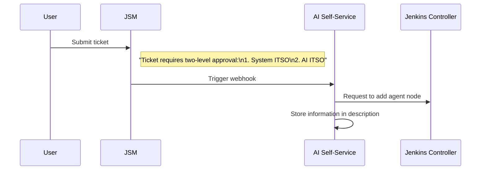
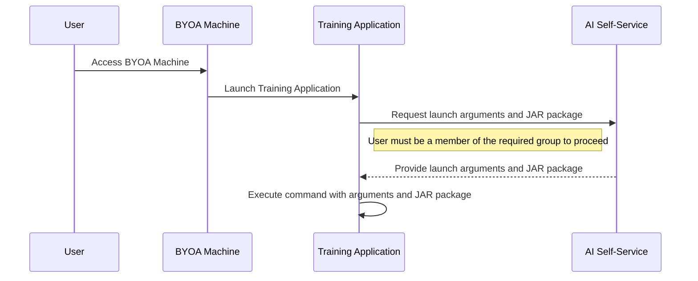

# Architectural Decision Record: Jenkins Node Type

## Status

## Context
In our solution, Jenkins agents are required to execute build and deployment tasks to the QA environment. These agents can be configured in different ways depending on the use case and infrastructure requirements. Therefore, we recommend users to prioritize the first type - BYOA. However, we also provide two other options:

1. **BYOA (Bring Your Own Agent)**: Custom agents provided and managed by the user.
2. **MSDE Agent**: Managed agents provided by MSDE.
3. **CKS Agent**: Pods from CKS.

Context:

In our continuous integration and deployment (CI/CD) pipeline, Jenkins agents are essential for executing build and deployment tasks, particularly targeting the Quality Assurance (QA) environment. The selection of an appropriate agent configuration is influenced by specific use cases and infrastructure requirements. To accommodate diverse needs, we offer the following agent options:​

Bring Your Own Agent (BYOA): Custom agents provided and managed by the user.​

MSDE Agent: Managed agents provided by MSDE.​

CKS Agent: Pods from CKS.​

Decision:

After evaluating the available options, we recommend prioritizing the Bring Your Own Agent (BYOA) approach. This strategy allows users to tailor agents to their specific requirements, ensuring optimal performance and compatibility with their existing systems. While BYOA is our preferred solution, the MSDE Agent and CKS Agent options remain available to cater to varying organizational needs and infrastructure setups.

## BYOA
### Register flow diagram

Incorporating a Jira Service Management (JSM) workflow to oversee the addition of Jenkins agent nodes offers several key advantages:

Enhanced Oversight and Compliance: By routing node addition requests through JSM, IT Security Officers (ITSOs) can monitor and approve each request, ensuring that all changes adhere to organizational policies and compliance requirements. This structured approval process provides a clear audit trail, detailing which nodes are added and by whom.

Controlled Access and Security: Restricting the ability to add agent nodes exclusively to the AI Self-Service system prevents users from making unauthorized changes directly through the Jenkins portal. This limitation reduces potential security risks and ensures that only validated and approved nodes are integrated into the Jenkins environment.

Automated Validation and Standardization: The self-service system can implement automated validation checks to ensure that only nodes meeting specific criteria are added. This automation maintains consistency and compliance with predefined standards, reducing the likelihood of configuration errors.

By integrating JSM workflows and the AI Self-Service system into the Jenkins node management process, organizations can achieve a balance between operational efficiency and robust security controls.

### Agent Launch diagram

Incorporating an AI Self-Service system to provide launch arguments and the JAR package for the training application enhances security by:

Preventing Exposure of Sensitive Data: Passing sensitive information, such as passwords or secure texts, directly as command-line arguments can lead to unintended exposure, as these arguments may be visible to other users or processes on the system. 
STACK OVERFLOW

Centralized Access Control: A centralized system simplifies data access policies, enabling efficient management of who can access sensitive information, thereby enhancing security and compliance. 
PRIVACERA

By utilizing the AI Self-Service system, organizations can effectively safeguard sensitive information and maintain robust security practices.

Consequence
Adopting the BYOA (Bring Your Own Agent) model allows users to create and manage agents tailored to their specific needs. This approach supports greater flexibility, performance optimization, and integration with existing infrastructure. Teams can configure agents with the tools, environments, and permissions best suited for their workflows.

To ensure consistency and security, the integration of JSM and the AI Self-Service system introduces a controlled and auditable process for agent registration and launch. This enables better compliance, centralized access control, and reduced risk of exposing sensitive data.

While this model increases customization and scalability, it also requires users to take responsibility for maintaining their own agents and following standard onboarding procedures. The support for MSDE and CKS agents provides alternative options for teams that need managed or container-based solutions, offering a balanced architecture that can accommodate a wide range of use cases.
